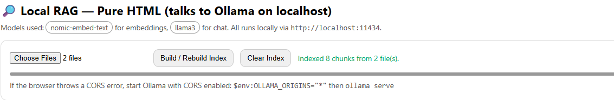
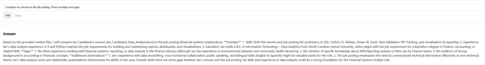
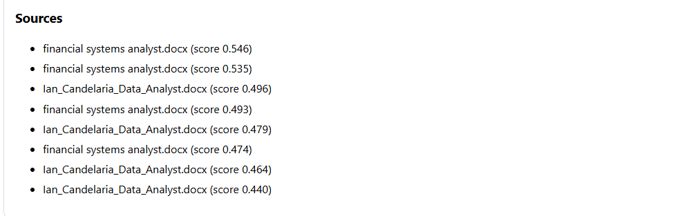

\# Local RAG (HTML + Ollama)


This is a simple Retrieval-Augmented Generation (RAG) app that runs entirely on your computer.

It compares documents like resumes and job postings, finds overlaps and gaps, and answers questions with sources.

Everything runs locally using Ollama — no cloud, no Python needed.


\## How it works

\- \*\*Embeddings:\*\* Uses `nomic-embed-text` to convert text into vectors.  

\- \*\*Retrieval:\*\* Finds the most relevant chunks with cosine similarity.  

\- \*\*LLM:\*\* Uses `llama3` for responses.  

\- \*\*Privacy:\*\* All processing stays on your machine.  


\## Setup


\### 1. Install Ollama

Download Ollama for Windows from \[ollama.com](https://ollama.com).


\### 2. Pull the models

Open PowerShell and run:

```powershell

ollama pull llama3

ollama pull nomic-embed-text


\### 3. Allow browser apps (one-time)

Add a permanent environment variable:


1\. Search \*\*Edit the system environment variables\*\* in Windows.  

2\. Click \*\*Environment Variables…\*\*  

3\. Under \*\*User variables\*\*, click \*\*New…\*\*  

&nbsp;  - Name: `OLLAMA\_ORIGINS`  

&nbsp;  - Value: `\*`  

4\. Click OK → OK → Reboot.


\### 4. Open the app

\- Double-click `index.html`  

\- Or make a Chrome/Edge shortcut with:

chrome.exe --app="file:///C:/Projects/local-rag/index.html"


\## Usage

1\. Click \*\*Choose Files\*\* and select your resume + a job posting (PDF, DOCX, TXT, etc.).  

2\. Click \*\*Build / Rebuild Index\*\*.  

3\. Type a question like:  

&nbsp;  - “Compare my resume to the job posting. List skill overlaps and gaps.”  

&nbsp;  - “Summarize the job posting in 5 bullet points.”  

4\. See the \*\*Answer\*\* and check \*\*Sources\*\* to know where the info came from.


\## Example Prompts

\- “What skills in my resume match this job posting?”  

\- “What skills are missing from my resume?”  

\- “Write 3 tailored resume bullets grounded in this posting.”  


\## Screenshots

### Indexed 2 Files


### Resume vs Job Posting Comparison


### Sources with Citations



\## Why this project

This project shows how to build a \*\*fully local AI application\*\* that runs like a real app:

\- One-click open in the browser  

\- No Python or cloud setup  

\- Private and fast (runs on your GPU with Ollama)  


---


\## Resume Bullet (optional)

\*Built a local Retrieval-Augmented Generation (RAG) app using Ollama (llama3 + nomic-embed-text). Packaged as a one-click desktop browser app with citation-based answers. Demonstrated resume-to-job-posting comparison with skill overlap/gap analysis.\*

